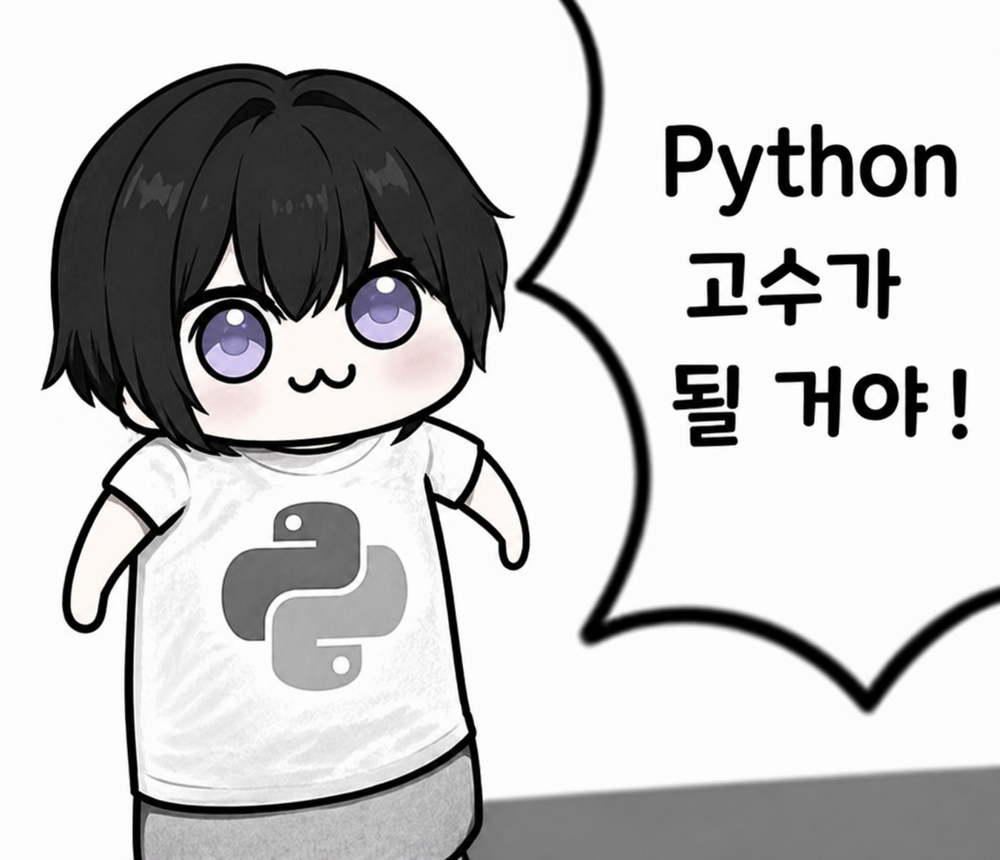

    

<em><b>비엔봉의 코딩테스트 공부</b>: 알고리즘 GOSU가 될 거야</em>

---

~~백준(BOJ)~~(섭종), 프로그래머스(Programmers), SWEA, Codetree, LeetCode에서 푼 문제가 업로드 되는 저장소 입니다.

with grateful thanks to [백준 허브 (Baekjoon Hub)](https://github.com/BaekjoonHub/BaekjoonHub)

---

# 내 티어 및 활동

